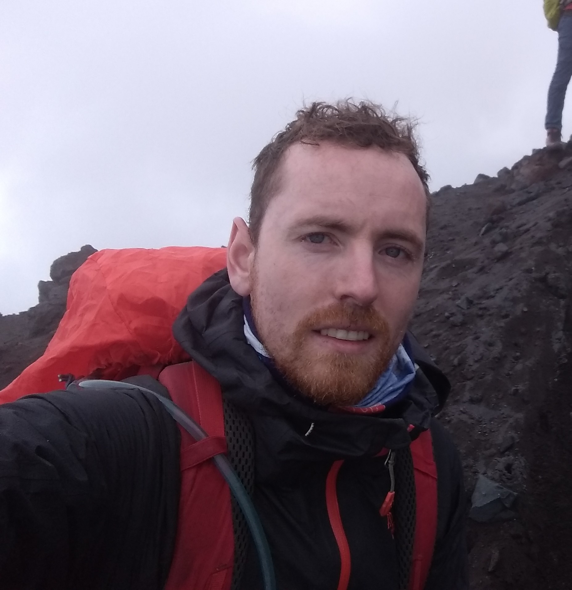

<!-- Generated from resume.yaml by `npm run resume:build`. -->

<strong>Phone</strong> +34 639981732

<strong>Email</strong> john@jkirwan.org

<strong>Website</strong> jkirwan.org

<strong>GitHub</strong> JohnKirwan

<strong>LinkedIn</strong> johndkirwan

<strong>ORCID</strong> 0000-0001-5537-3574

<h2 style="margin:18px 0 8px;font-size:12px;letter-spacing:.12em;color:#555;text-transform:uppercase;">Technical Skills</h2>
PythonData ScienceR

<h2 style="margin:18px 0 8px;font-size:12px;letter-spacing:.12em;color:#555;text-transform:uppercase;">Languages</h2>

English (Native)Swedish (B2)Spanish (B2)

<h1 style="font-size:28px;line-height:1.2;margin:0 0 6px;font-weight:700;">Dr. John D. Kirwan</h1>

Computational Biologist and Senior Scientist

Computational biologist working at the interface of data science and biology,
applying statistical and machine learning approaches to uncover structure in
complex biological data.

<h2 style="margin:22px 0 10px;font-size:12px;letter-spacing:.12em;color:#555;text-transform:uppercase;">Experience</h2>
<h3 style="margin:14px 0 6px;font-size:14px;font-weight:700;">Bioinformatics Researcher — <em>Arquimea Research Centre, La Laguna, Spain</em> (Jul 2022-present)</h3>
My current role focuses on pharmaceutical bioinformatics.
<ul style="list-style:none;margin:6px 0 10px 0;padding-left:0;"><li style="margin:0 0 4px;">&bull; Structural biology, using AlphaFold and related tools</li><li style="margin:0 0 4px;">&bull; Proteomics and other -omics approaches</li><li style="margin:0 0 4px;">&bull; Deep learning modeling, including Pytorch and Tensorflow</li><li style="margin:0 0 4px;">&bull; Biostatistics and probabilistic modelling, using PyMC and Stan</li></ul>
<h3 style="margin:14px 0 6px;font-size:14px;font-weight:700;">Post-doctoral Researcher — <em>Stazione Zoologica Anton Dohrn, Naples, Italy</em> (Oct 2019-Jun 2022)</h3>
Researched the photic behaviour of sea urchins as part of an international HFSP collaboration.
<ul style="list-style:none;margin:6px 0 10px 0;padding-left:0;"><li style="margin:0 0 4px;">&bull; Designed and carried out behavioural experiments</li><li style="margin:0 0 4px;">&bull; Performed statistical analysis</li></ul>
<h3 style="margin:14px 0 6px;font-size:14px;font-weight:700;">Project Manager - Vision Research — <em>Lund University, Lund, Sweden</em> (Jun 2019-Aug 2019)</h3>
Carried out vision science behavioural experiments and analysis using R, Matlab and Python.
<ul style="list-style:none;margin:6px 0 10px 0;padding-left:0;"><li style="margin:0 0 4px;">&bull; Co-advised an MSc student</li></ul>
<h3 style="margin:14px 0 6px;font-size:14px;font-weight:700;">Doctoral Researcher — <em>Lund University, Lund, Sweden</em> (May 2013-Jun 2018)</h3>
Wrote my PhD thesis 'Spatial Vision in Diverse Invertebrates' at the Lund Vision Group, Sweden.
<ul style="list-style:none;margin:6px 0 10px 0;padding-left:0;"><li style="margin:0 0 4px;">&bull; Combined optics, behaviour, and Bayesian statistics</li><li style="margin:0 0 4px;">&bull; Developed methods to measure spatial resolution in simple visual systems</li></ul>
<h3 style="margin:14px 0 6px;font-size:14px;font-weight:700;">Expedition Assistant Leader — <em>Lowest to Highest for Cancer Expedition, Everest Basecamp</em> (Apr 2013-May 2013)</h3>
Assistant leader for an expedition to Everest Basecamp.

<h2 style="margin:22px 0 10px;font-size:12px;letter-spacing:.12em;color:#555;text-transform:uppercase;">Education</h2>
<h3 style="margin:14px 0 6px;font-size:14px;font-weight:700;">PhD Sensory Biology — <em>Lund University, Sweden</em> (May 2013-May 2018)</h3><ul style="list-style:none;margin:6px 0 10px 0;padding-left:0;"><li style="margin:0 0 4px;">&bull; Thesis 'Spatial Vision in Diverse Invertebrates'.</li></ul>
<h3 style="margin:14px 0 6px;font-size:14px;font-weight:700;">MSc Molecular Evolution — <em>University College Dublin, Ireland</em> (Dec 2008-Jun 2010)</h3><ul style="list-style:none;margin:6px 0 10px 0;padding-left:0;"><li style="margin:0 0 4px;">&bull; Thesis: 'The Molecular Evolution of Hearing in Mammals'</li></ul>
<h3 style="margin:14px 0 6px;font-size:14px;font-weight:700;">BSc (Hons) Zoology — <em>University College Dublin, Ireland</em> (Sep 2004-May 2008)</h3><ul style="list-style:none;margin:6px 0 10px 0;padding-left:0;"><li style="margin:0 0 4px;">&bull; GPA: 4.02/4.2</li></ul>

<h2 style="margin:22px 0 10px;font-size:12px;letter-spacing:.12em;color:#555;text-transform:uppercase;">Awards</h2><ul style="list-style:none;margin:6px 0 10px 0;padding-left:0;"><li style="margin:0 0 6px;">&bull; Customising your models with TensorFlow 2 — Coursera / Imperial College London (2025-08-14)</li><li style="margin:0 0 6px;">&bull; Valohai MLOps Fundamentals Certification — Valohai (2025-08-12)</li><li style="margin:0 0 6px;">&bull; Applied Software Engineering Fundamentals Specialization — Coursera / IBM (2023-03-10)</li><li style="margin:0 0 6px;">&bull; Pharmaceutical Bioinformatics &amp; Applied Pharmaceutical Bioinformatics — Uppsala University (2020-05-31)</li><li style="margin:0 0 6px;">&bull; Mountain Leader Award — Mountain Leader Training Scotland (2011-10-01)</li></ul>

<h2 style="margin:22px 0 10px;font-size:12px;letter-spacing:.12em;color:#555;text-transform:uppercase;">Bio</h2>
I'm a computational biologist working at the interface of data science and biology,
applying statistical and machine learning approaches to uncover structure in complex
biological data. I am a senior scientist at Arquimea Research Centre, La Laguna, Spain.

My background spans experimental biology, computational modeling, and bioinformatics.
After completing a PhD at Lund University focused on visual systems in invertebrates, I
transitioned toward data-driven biology, developing analytical tools and predictive
models that bridge biological insight and computation.

I enjoy learning new analytical methods, writing code, and communicating science clearly.
My goal is to continue growing as a biological data scientist, expanding across diverse
fields within the life sciences while keeping biological meaning at the core of the analysis.

