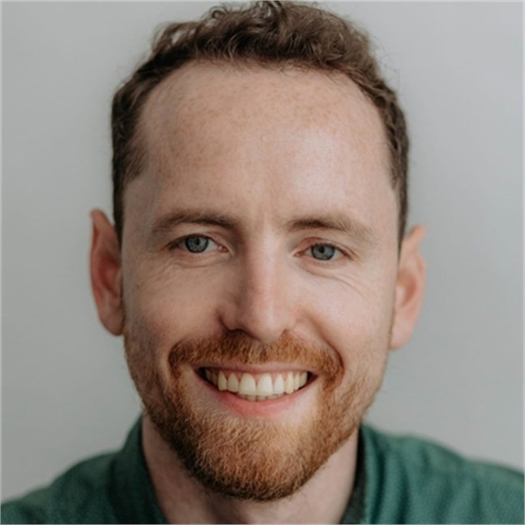

<!-- Generated from data/authors/admin.yaml by `npm run resume:build`. -->

<strong>Location</strong> San Cristóbal de la Laguna, Spain

<strong>Phone</strong> +34 639981732

<strong>Email</strong> john@jkirwan.org

<strong>Website</strong> jkirwan.org

<strong>GitHub</strong> JohnKirwan

<strong>LinkedIn</strong> johndkirwan

<strong>ORCID</strong> 0000-0001-5537-3574

<h2 style="margin:18px 0 8px;font-size:12px;letter-spacing:.12em;color:#555;text-transform:uppercase;">Technical Skills</h2>
PythonRPyTorchTensorFlowMachine LearningDeep LearningStatistical ModellingBayesian StatisticsProtein Structure PredictionStructural BioinformaticsMetagenomicsDockerGitAzure DevOpsAWSValohaiMatlab

<h2 style="margin:18px 0 8px;font-size:12px;letter-spacing:.12em;color:#555;text-transform:uppercase;">Languages</h2>

English (Native)Spanish (B2)Swedish (B2)

<h1 style="font-size:28px;line-height:1.2;margin:0 0 6px;font-weight:700;">Dr. John D. Kirwan</h1>

Computational Biologist · Bioinformatics &amp; Machine Learning · Biostatistics

Computational biologist and data scientist pairing rigorous statistical modelling — Bayesian inference and deep learning — with hands-on ML engineering and reproducible pipelines. Nearly four years at the interface of biotech and AI in an industry research setting, spanning biomolecular structure prediction, generative molecular design, and metagenomic analysis, and including a contribution to a NeurIPS 2025 publication on uncertainty quantification.

<h2 style="margin:22px 0 10px;font-size:12px;letter-spacing:.12em;color:#555;text-transform:uppercase;">Experience</h2>
<h3 style="margin:14px 0 6px;font-size:14px;font-weight:700;">Bioinformatics Scientist — <em>Arquimea Research Centre, La Laguna, Spain</em> (Jul 2022-Mar 2026)</h3>
Worked at the interface of the AI and biotech teams on structure-based drug discovery,
generative molecular design, and applied machine learning — the link between the
computational tools and the biology. Contributing author on a NeurIPS 2025 publication
on uncertainty quantification in deep regression.
<ul style="list-style:none;margin:6px 0 10px 0;padding-left:0;"><li style="margin:0 0 4px;">&bull; Built a modular synthetic-data-generation workflow orchestrating GNINA, DiffDock and AlphaFold 2; sourced datasets and handled inter-tool format conversion</li><li style="margin:0 0 4px;">&bull; Predicted protein structures and binding affinities for protein complexes, including metal-ion and ATP cofactors, using Boltz, AlphaFold, Foldseek and BioEMU</li><li style="margin:0 0 4px;">&bull; On the engine team of Uncharted, an internal venture building a multi-objective small-molecule optimisation platform; developed the binding-affinity objective</li><li style="margin:0 0 4px;">&bull; Analysed metagenomic data, prototyped a novel operon-design approach, and ran preclinical power analyses</li><li style="margin:0 0 4px;">&bull; On the NeurIPS 2025 work: ran empirical validation and fine-tuned/retrained the model in PyTorch, informed by a Bayesian / Monte Carlo perspective</li><li style="margin:0 0 4px;">&bull; Ran GPU workloads on an NVIDIA DGX cluster and AWS; Docker, Git and Azure DevOps within an Agile/Scrum team</li></ul>
<h3 style="margin:14px 0 6px;font-size:14px;font-weight:700;">Postdoctoral Researcher — <em>Stazione Zoologica Anton Dohrn, Naples, Italy</em> (Oct 2019-Jul 2022)</h3>
Quantitative sensory biology within an international Human Frontier Science Program (HFSP)
collaboration, with emphasis on statistical modelling and signal processing of behavioural data.
<ul style="list-style:none;margin:6px 0 10px 0;padding-left:0;"><li style="margin:0 0 4px;">&bull; Analysed experimental data using Bayesian multilevel regression models in R and Stan</li><li style="margin:0 0 4px;">&bull; Designed and executed behavioural experiments with automated data acquisition pipelines</li><li style="margin:0 0 4px;">&bull; Contributed to interdisciplinary publications spanning biology, optics, and computation</li></ul>
<h3 style="margin:14px 0 6px;font-size:14px;font-weight:700;">Project Manager (contract) — <em>Lund University, Lund, Sweden</em> (Jun 2019-Aug 2019)</h3>
Short-term research management contract supervising experimental data collection and a masters student, bridging doctoral and postdoctoral positions.

<h3 style="margin:14px 0 6px;font-size:14px;font-weight:700;">Doctoral Researcher — <em>Lund University, Lund, Sweden</em> (May 2013-Jun 2018)</h3>
Computational and statistical analysis of visual systems in invertebrates,
combining experimental biology with quantitative modelling.
<ul style="list-style:none;margin:6px 0 10px 0;padding-left:0;"><li style="margin:0 0 4px;">&bull; Built statistical models using Bayesian multilevel regression in R and Stan; additional analysis in Python and Matlab</li><li style="margin:0 0 4px;">&bull; Developed optical and geometric models to estimate spatial resolution theoretically</li><li style="margin:0 0 4px;">&bull; Designed novel experimental protocols for quantifying animal visual performance</li></ul>

<h2 style="margin:22px 0 10px;font-size:12px;letter-spacing:.12em;color:#555;text-transform:uppercase;">Education</h2>
<h3 style="margin:14px 0 6px;font-size:14px;font-weight:700;">PhD Sensory Biology — <em>Lund University, Sweden</em> (May 2013-May 2018)</h3><ul style="list-style:none;margin:6px 0 10px 0;padding-left:0;"><li style="margin:0 0 4px;">&bull; Thesis: 'Spatial Vision in Diverse Invertebrates'.</li></ul>
<h3 style="margin:14px 0 6px;font-size:14px;font-weight:700;">MSc Molecular Evolution — <em>University College Dublin, Ireland</em> (Dec 2008-Jun 2010)</h3><ul style="list-style:none;margin:6px 0 10px 0;padding-left:0;"><li style="margin:0 0 4px;">&bull; Thesis: 'The Molecular Evolution of Hearing in Mammals'</li></ul>
<h3 style="margin:14px 0 6px;font-size:14px;font-weight:700;">BSc (Hons) Zoology — <em>University College Dublin, Ireland</em> (Sep 2004-May 2008)</h3><ul style="list-style:none;margin:6px 0 10px 0;padding-left:0;"><li style="margin:0 0 4px;">&bull; First Class Honours (GPA: 4.02/4.2)</li></ul>

<h2 style="margin:22px 0 10px;font-size:12px;letter-spacing:.12em;color:#555;text-transform:uppercase;">Awards</h2><ul style="list-style:none;margin:6px 0 10px 0;padding-left:0;"><li style="margin:0 0 6px;">&bull; Pharmaceutical Bioinformatics &amp; Applied Pharmaceutical Bioinformatics — Uppsala University (May 2020)</li><li style="margin:0 0 6px;">&bull; Customising your models with TensorFlow 2 — Coursera / Imperial College London (Aug 2025)</li><li style="margin:0 0 6px;">&bull; Valohai MLOps Fundamentals Certification — Valohai (Aug 2025)</li><li style="margin:0 0 6px;">&bull; Applied Software Engineering Fundamentals Specialization — Coursera / IBM (Mar 2023)</li><li style="margin:0 0 6px;">&bull; Mountain Leader Award — Mountain Leader Training Scotland (Oct 2011)</li></ul>

<h2 style="margin:22px 0 10px;font-size:12px;letter-spacing:.12em;color:#555;text-transform:uppercase;">Bio</h2>
Computational biologist and data scientist with a track record of applying machine
learning and statistical modelling to complex biological problems — from biomolecular
structure prediction and de novo peptide design to metagenomic analysis and preclinical
trial design.

My background combines rigorous quantitative training (Bayesian modelling, deep learning,
MLOps) with hands-on experience across the full data pipeline — from experimental design
through to deployment and reproducible reporting. I have worked at the interface of Biotech
and AI in an industry research setting, contributing to work that reached commercial spinout
stage and to a NeurIPS 2025 publication on uncertainty quantification in deep regression.

I am now focusing on structure-informed metagenomics, functional annotation, and
antimicrobial-resistance research — applying the same analytical rigour to questions where
structural and evolutionary insight meets large-scale biological data, with an eye to
applications across health, agriculture, and the environment.

